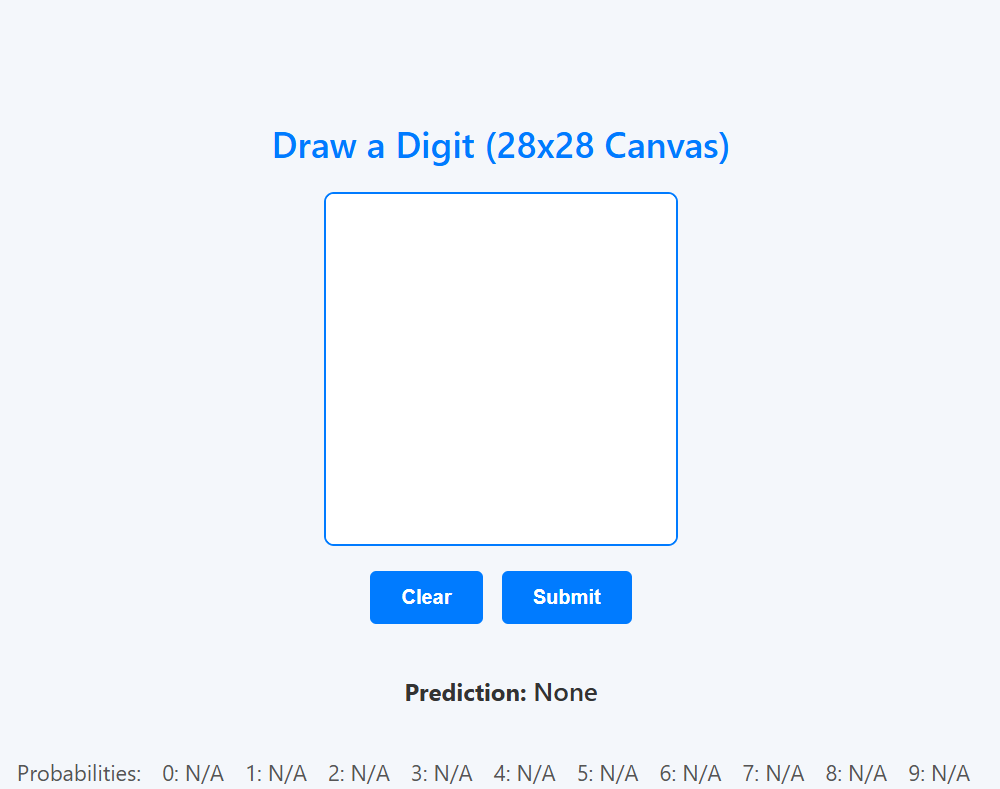
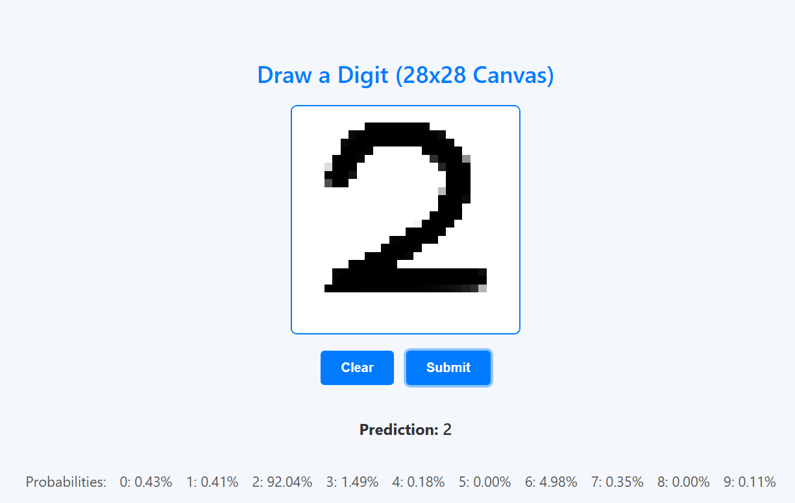
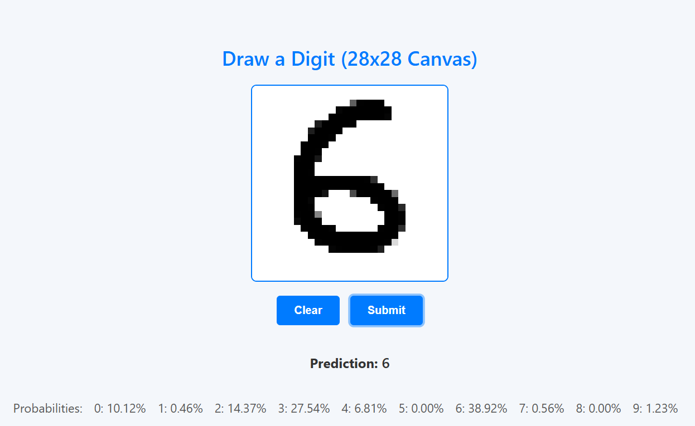
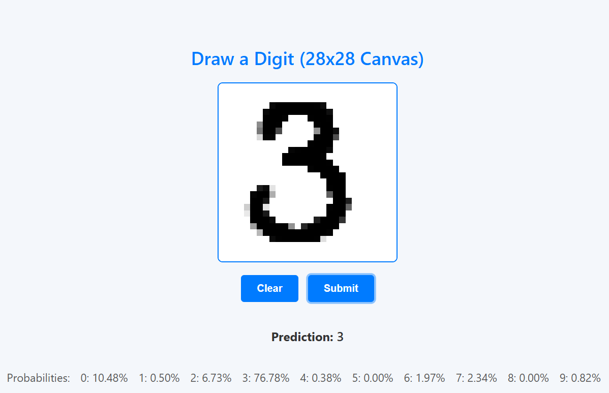
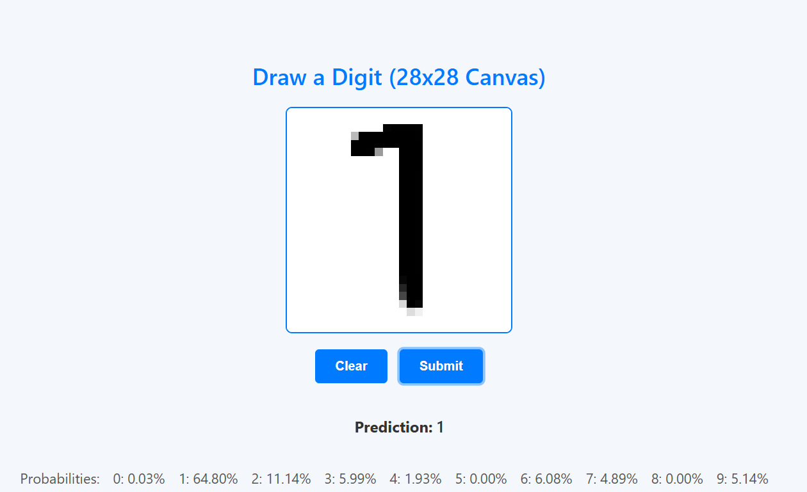

# Handwritten-Digit-Recognition
Handwritten Digit Recognition Using the MNIST Dataset from sctach using only numpy.

# App Name: [Handwritten-Digit-Recognition]

This repository contains the source code for the Handwritten-Digit-Recognition web application.

## Description

Handwritten-Digit-Recognition is a web-based application that allows users to draw a digit on a 28x28 canvas and submit it for prediction using a trained machine learning model. The app recognizes handwritten digits and provides both the predicted digit and the probability of each possible digit (from 0 to 9). It is designed to be intuitive and user-friendly, making it easy to interact with by simply drawing on the canvas. The Neural Network behind this app was trained using MNIST dataSET.

## Key Features:
- **Digit Drawing**: Users can freely draw digits on a 28x28 pixel canvas using the mouse.
- **Instant Prediction**: Once the drawing is submitted, the app predicts the digit and shows the corresponding probability for each possible digit.
- **Clear Canvas**: Users can easily clear the canvas to start a new drawing.
- **Responsive UI**: The app is designed to be responsive and works seamlessly across various screen sizes and devices.

## Screenshots

1. **Homepage**
   

2. **Prediction Results**
   
   
   
   

